# **Taller UseR! 2022 🌎 :: Scripts de R para QGIS Processing**

Si tiene preguntas, haga clic en **PARTICIPAR**:  

Este taller está dirigido a usuarios de `R` que han tenido un acercamiento con el análisis espacial de datos dentro de `QGIS` (**Software de Sistema de Información Geográfica libre y de código abierto**) o viceversa.

El objetivo es demostrar la utilidad y los beneficios que trae la **interoperabilidad** de `R` y `QGIS`
para el trabajo de datos geográficos de forma computacional (**geocomputación**), ya sea desde automatizar geoprocesos, realizar análisis estadísticos, hasta crear y agregar tus propias herramientas con sus respectivas documentaciones y ejemplos reproducibles.

### 🔵 **Prerrequisitos**📋📌

* Tener instalado lo siguiente:

  * `R`
  * `Rstudio`
  * `QGIS`

* Conocer flujo de trabajo en scripts dentro de `R`

* Conocer modelos de datos espaciales (**vector** y **raster**)

* Tener una cuenta en **GitHub**

### 🔵 **Docentes** 🏫

<table class="default" align="center">
  
  <tr align="center">
    <td><h2><b>Gabo Gaona</b></h2></td>
    <td><h2><b>Antony Barja</b></h2></td>
  </tr>
  
  <tr align="center">
    <td></td>
    <td></td>
  </tr>

  <tr align="center">
    <td>Líder de <b><a href="#">RSpacial</a></b> en español Científico de datos</td>
    <td>Líder de <b><a href="https://github.com/qgispe">QGIS Perú</a></b>   Científico de datos en formación</td>
  </tr>

<tr align="center">
    <td>
      &nbsp;&nbsp;&nbsp;
      &nbsp;&nbsp;&nbsp;
      &nbsp;&nbsp;&nbsp;
      
    </td>
    <td>
      &nbsp;&nbsp;&nbsp;
      &nbsp;&nbsp;&nbsp;
      &nbsp;&nbsp;&nbsp;
      
    </td>
  </tr>

</table>

### 🔵 **Cronograma** 🕐

```mermaid
gantt
    title Scripts de R para QGIS Processing
    dateFormat HH:mm:ss
    axisFormat  %H:%M

    section Gabo y Antony
    Bienvenida e introducción : active, des1, 15:00:00, 10m

    section Antony
    Instalación y configuración de QGIS Processing R : des2, after des1, 20m

    section Gabo Ganoa
    Tu primera herramienta de QGIS hecha con R: des3, after des2,15m

    section Gabo y Antony
    Documentando Rscripts para QGIS: des4,after des3, 15m
    
    section Gabo Ganoa
    Herramientas para datos no espaciales: des5,after des4, 20m
    Configuración avanzada “de novato a pro” : des6, after des5, 20m
    
    section Gabo y Antony 
    Compartiendo tu herramienta a la comunidad de QGIS: des7,after des6,20m
    Probando scripts de estudiantes: des8, after des7,10m
    Conclusión y despedida: des9, after des8,10m
```

### 🔵 **Fecha y medio de transmisición**

* 🗓 12/07/2022 a las 🕟 17:00 🕢 19:30
* 🌐 on-line
* ⏳ 2️.5 horas

### 🔵 **Referencias**
