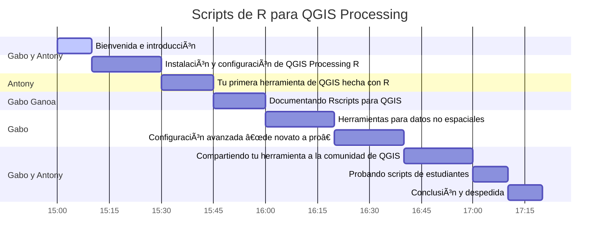

# **Taller UseR! 2022 🌠:: Scripts de R para QGIS Processing** 

Si tiene preguntas, haga clic en **PARTICIPAR**:  

Este taller está dirigido a usuarios de `R` que han tenido un acercamiento con el análisis espacial de datos dentro de `QGIS` (**Software de Sistema de Información Geográfica libre y de código abierto**) o viceversa. 

El objetivo es demostrar la utilidad y los beneficios que trae la **interoperabilidad** de `R` y `QGIS` 
para el trabajo de datos geográficos de forma computacional (**geocomputación**), ya sea desde automatizar geoprocesos, realizar análisis estadísticos, hasta crear y agregar tus propias herramientas con sus respectivas documentaciones y ejemplos reproducibles. 

### 🔵 **Prerrequisitos**📋📌

* Tener instalado lo siguiente: 

  * `R`
  * `Rstudio`
  * `QGIS` 

* Conocer flujo de trabajo en scripts dentro de `R`

* Conocer modelos de datos espaciales (**vector** y **raster**)

* Tener una cuenta en **GitHub**

### 🔵 **Docentes** ğŸ«

* 🧔🻠__Gabo Gaona__   (**Líder de [RSpacial en español](), Científico de datos**)

* 👨🽠[__Antony Barja__]()  (**Líder de [QGIS Perú](), Científico en formación dentro de [Healthinnovation Lab]()**)

### 🔵 **Cronograma** ğŸ•

```mermaid
gantt
    title Scripts de R para QGIS Processing
    dateFormat HH:mm:ss
    axisFormat  %H:%M

    section Gabo y Antony
    Bienvenida e introducción : active, des1, 15:00:00, 10m

    section Antony
    Instalación y configuración de QGIS Processing R : des2, after des1, 20m

    section Gabo Ganoa
    Tu primera herramienta de QGIS hecha con R: des3, after des2,15m

    section Gabo y Antony
    Documentando Rscripts para QGIS: des4,after des3, 15m
    
    section Gabo
    Herramientas para datos no espaciales: des5,after des4, 20m
    Configuración avanzada “de novato a pro†: des6, after des5, 20m
    
    section Gabo y Antony 
    Compartiendo tu herramienta a la comunidad de QGIS: des7,after des6,20m
    Probando scripts de estudiantes: des8, after des7,10m
    Conclusión y despedida: des9, after des8,10m
```

### 🔵 **Fecha y medio de transmisición**

- 🗓 12/07/2022 a las 🕟 17:00 🕢 19:30 
- 🌠on-line
- â³ 2ï¸.5 horas

### 🔵 **Referencias**

