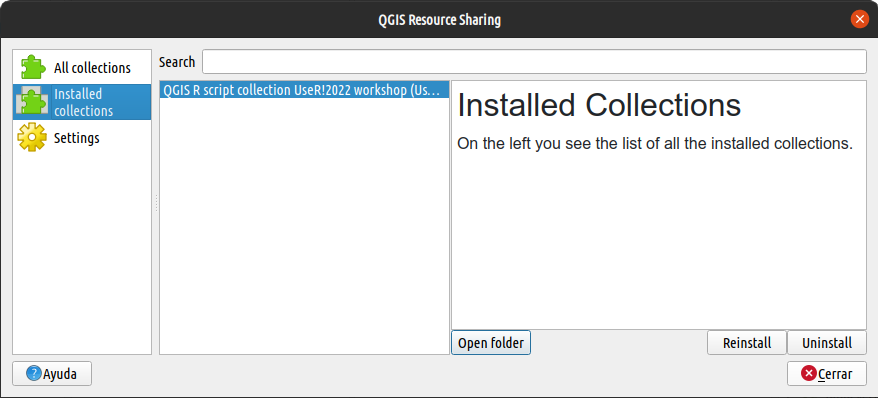
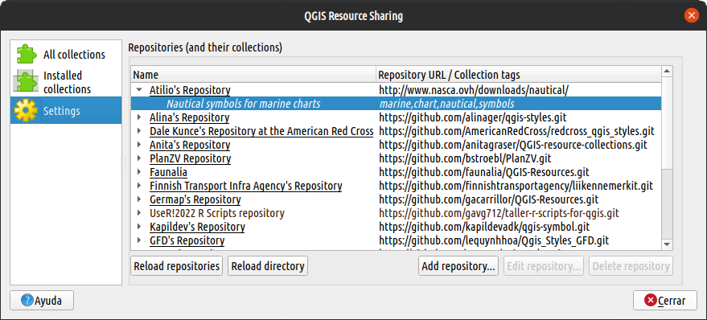
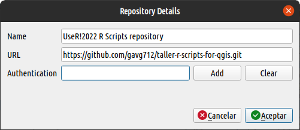
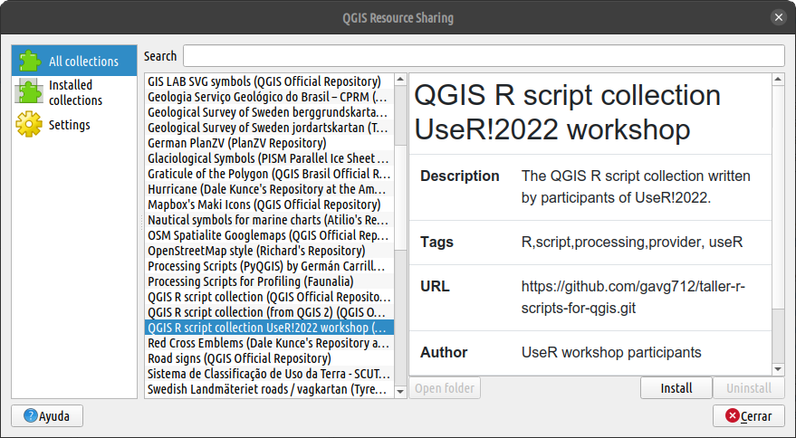

QGIS Resources Sharing is an plugin for QGIS that allows sharing styles, scripts, models and many more resources with the community. In this workshop we will use this plugin as a method of sharing R scripts from the workshop. It is expected that all participants will install it in their QGIS and that it will be available for use in the different scheduled activities. Below we will detail how to install the plugin and how to configure it for workshop use.

## Installation

QGIS Resource Sharing can be installed from the *"QGIS Plugin Manager"*.

Once installed, the plugin's interface can be opened from the menu `Plugins/Resource sharing/Resource sharing`. The interface has three main sections displayed as panels in a sidebar:

-   `"All collections"` shows all collections of symbols, scripts, models, etc., that are available to install. From this section you can install/uninstall/reinstall a collection of interest.

    

-   `"Installed collections"` shows the collections installed in the QGIS profile. An installed collection can be updated by clicking on the `[Reinstall]` button.

    

-   `"Settings"` is used to manage collection repositories. The plugin comes with a list of default repositories with perfectly usable resources. Among many others we can find the official QGIS repository. More repositories can be added using the `[Add repository]` button. We will use this last function to add the workshop repository.

    

## Workshop repository setup

From the `Settings` panel we will add the Github repository of the workshop. To do it we click on the `[Add repository]` button and fill in the fields with the following information:

-   **Name**: UseR!2022 R Scripts repository
-   **URL**: <https://github.com/gavg712/taller-r-scripts-for-qgis.git>
-   **Autentication**: `< Vacío >`

... finally click on the `[Accept]` button.

## Installation of the R scripts workshop's collection. 

Now we go back to the `"All collections"` panel and search for the collection named *"QGIS R script collection UseR!2022 workshop"*. Once located, select it and click on the `[Install]` button.

**Note: to update the collection, just reinstall it.**

Now, in the processing toolbox you will see a group of R scripts called *"Taller UserR!2022"*

