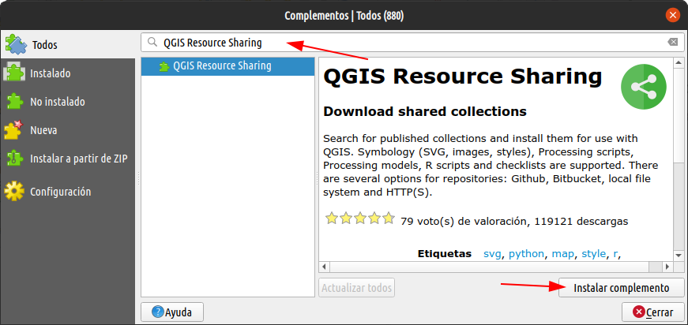
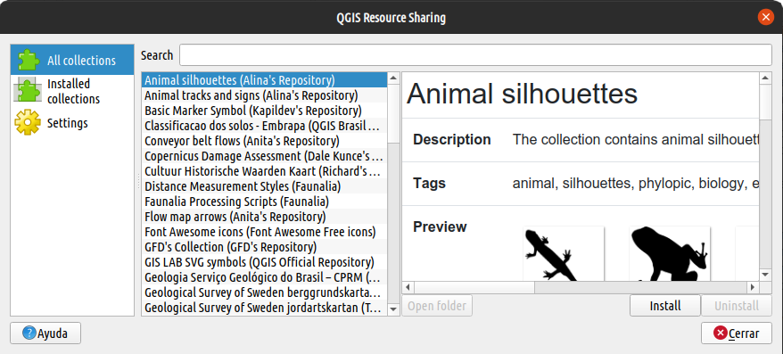
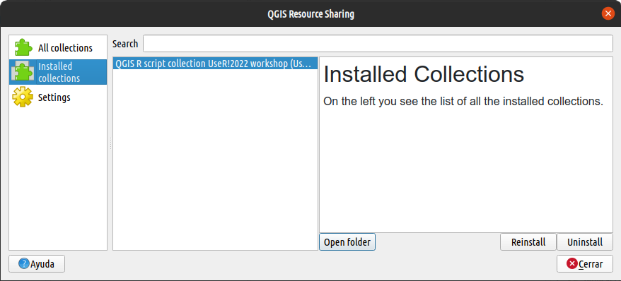
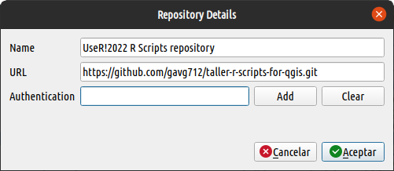
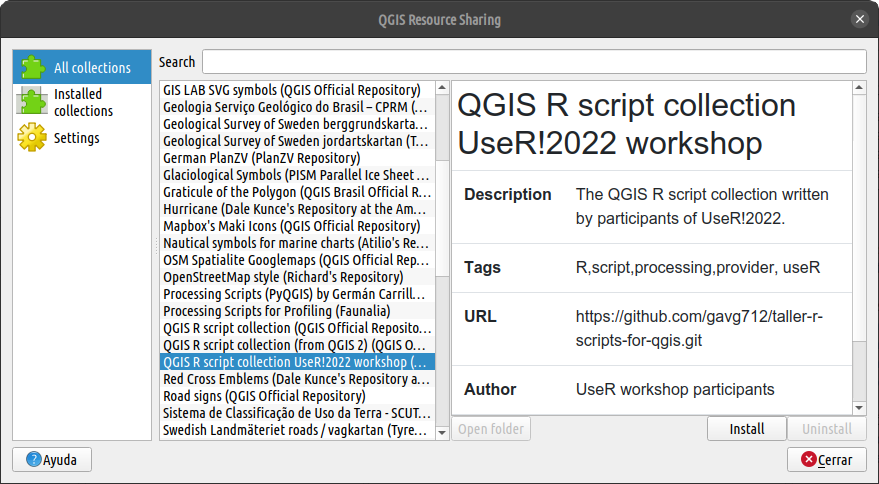
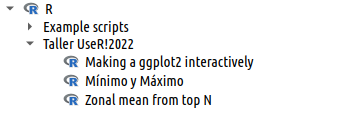

## Introducción

QGIS Resources Sharing es un complemento para QGIS que permite compartir
estilos, scripts, modelos y muchos más recursos con la comunidad. En este taller
usaremos este complemento como método de transferencia de scripts R del taller.
Se espera que todos los participantes lo instalen en su QGIS y que esté
disponible para su uso en las diferentes actividades programadas. A continuación
detallaremos cómo instalar el plugin y configurarlo para su uso del taller.

## Instalación del complemento

QGIS Resource Sharing se puede instalar desde el *"Administrador de
complementos"* de QGIS.

Una vez instalado se puede abrir la interfaz del complemento desde el menú
`Complementos/Resource sharing/Resource sharing`. La interfaz tiene tres
secciones principales que se muestran como paneles en una barra lateral:

-   `"All collections"`, muestra todas las colecciones de símbolos, scripts,
    modelos, etc., que están disponibles para instalar. Desde esta sección se
    puede instalar/desinstalar/reinstalar una colección de interés.

    

-   `"Installed collections"`, muestra las colecciones instaladas en el perfil
    de QGIS. Una colección instalada puede ser actualizada mediante el botón de
    `[Reinstall]`.

    

-   `"Settings"`, administrar los repositorios de colecciones. El plugin viene
    con una lista de repositorios por defecto con recursos perfectamente
    utilizables. Entre muchos otros podemos encontrar el repositorio oficial de
    QGIS. Se puede agregar más repositorios usando el botón `[Add repository]`.
    Usaremos esta última función para agregar el repositorio del taller.

    

## Configuración del repositorio del taller

Desde el panel de `Settings` agregaremos el repositorio Github del taller. Para
ello hacemos un clic en en botón `[Add repository]` y en rellenamos los campos
con la siguiente información:

{}
-   **Name**: UseR!2022 R Scripts repository
-   **URL**: <https://github.com/gavg712/taller-r-scripts-for-qgis.git>
-   **Autentication**: `< Vacío >`
{}

... finalmente Clic en el botón `[Aceptar]`

## Instalación de la colección de scripts R del taller

Ahora volvemos al panel de `"All collections"` y buscamos la colección llamada
*"QGIS R script collection UseR!2022 workshop".* Una vez localizada, la
seleccionamos y hacemos un clic en el botón `[Install]`

Ahora, en la caja de herramientas de processing podrás ver un grupo de scripts
de R, denominado *"Taller UserR!2022"*

{}
Si quieres actualizar un colección solo basta con reinstalarla. En el caso que nos compete, abre el complemento de *Resources sharing*, busca la coleción y da clic en el botón `[Reinstall]`
{}

