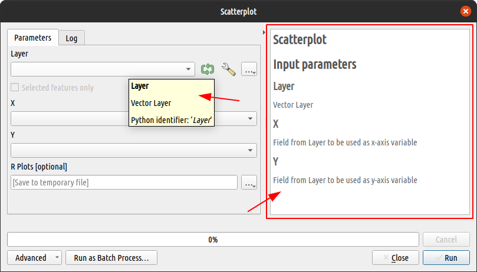

## Introduction

Documenting software and scripts is a task that is in great demand by users. The best software tools in any field have particular emphasis on user documentation. This ensures that the tool is used by a large number of people.

QGIS and R are no exception. They have enough documentation as necessary to make life easier for their users. Even at the parameter level, according to Nyall Dawson ([Comentario #104:1028490076](https://github.com/north-road/qgis-processing-r/pull/104#issuecomment-1028490076)):

> *...there is a move for the QGIS "core" algorithms to provide better help to users by adding explanatory tooltips to individual parameters, so in that regard I can see having this support in the R provider as a good thing*

That is what we want to convey with this second exercise. To provide the user with enough information on how to use an R script for *QGIS Processing*.

## Writing the documentation

We know that an R script for *QGIS Processing* has two fundamental parts to execute a process: The header and the body. However, a third section of information can also be added to complement the tool. This third section is usually written in a complementary file with extension `rsx.help`.

### `rsx.help` files

The help file must be located in the same directory and have the name of the script, but with extension `.rsx.help`. The content of this file is a JSON object with the descriptions of the parameters used in the script. 

For example, suppose we have added a script file named `simple_scatterplot.rsx` with the following content:

```r
##Example scripts=group
##Scatterplot=name
##output_plots_to_html
##Layer=vector
##X=Field Layer
##Y=Field Layer

# simple scatterplot
plot(Layer[[X]], Layer[[Y]])
```

The help file should be named `simple_scatterplot.rsx.help` and its minimum content should be:

```json
{
"Layer": "Vector Layer",
"X": "Field from Layer to be used as x-axis variable",
"Y": "Field from Layer to be used as y-axis variable"
}
```



Note that the description of each parameter is composed of a `"key": "value"` pair and is separated from other parameters by a comma (,). This file could already be used for the description of the new tool. But there are still more things we can use to give it more informative value. There are a few special parameters that do not have a name defined by the script author but by the plugin as such. These are:

- `"ALG_DESC"`. This is the general description of the tool. It will be displayed immediately after the title of the help section.
- `"ALG_VERSION"`. Used to specify the version of the script, especially when the author maintains version control.
- `"ALG_CREATOR"`. Is used to define the name of the script author.
- `"ALG_HELP_CREATOR"`. Is to define the name of the person who wrote the help for the script.
- `"RPLOTS"`. Is the description for the output graph in case the script generates a graph.
- `"R_CONSOLE_OUTPUT"`. Is the description for the console log file in case the script includes a console output.

Any of these parameters can be added to the JSON of the `rsx.help` file, always keeping the `"key": "value"` structure. If we continue with our previous example we can add several of these parameters to the description. Thus:

```json
{
"Layer": "Vector Layer",
"X": "Field from Layer to be used as x-axis variable",
"Y": "Field from Layer to be used as y-axis variable",
"RPLOTS": "Output path for html file with the scatterplot",
"ALG_DESC": "This file creates a simple scatterplot from two fields in a vector layer",
"ALG_CREATOR": "Name of algorithm creator",
"ALG_HELP_CREATOR": "Name of help creator",
"ALG_VERSION": "0.0.1"
}
```


### Help as script lines (Coming soon in version 3.2.0 [#104](https://github.com/north-road/qgis-processing-r/pull/104))

As of version 3.2.0 of the plugin, it is also possible to enter the documentation as lines in the script itself. This makes it possible to dispense with the `rsx.help` file. To do so, the documentation lines must be written with the structure `#' Parameter: Description` . Let's see how it would look like using the above example. Look at lines 11-19, does it look familiar?


```r
##Example scripts=group
##Scatterplot=name
##Gráfico de dispersión=display_name
##output_plots_to_html
##Layer=vector
##X=Field Layer
##Y=Field Layer

# simple scatterplot
plot(Layer[[X]], Layer[[Y]])

#' Layer: Vector Layer
#' X: Field from Layer to be used as x-axis variable
#' Y: Field from Layer to be used as y-axis variable
#' RPLOTS: Output path for html file with the scatterplot
#' ALG_DESC: This file creates a simple scatterplot from 
#'         : two fields in a vector layer
#' ALG_CREATOR: Name of algorithm creator
#' ALG_HELP_CREATOR: Name of help creator
#' ALG_VERSION: 0.0.1
```

The result will be displayed exactly as when using the help files. In addition, note that in this way it is also possible to enter the description of a parameter in several lines. To do this, it is necessary to continue the subsequent lines without entering the parameter name, like `#' : additional description`.

## Structure and styles with HTML.

In the help lines you can also enter small HTML code elements. This will be evaluated when running the tool. Unfortunately not all HTML and CSS3 goodness can be used. However some things will work.

```html
{
"Layer": "Vector Layer",
"X": "A <b>Field</b> from <em>Layer</em> to be used as <code style='background-color: yellow;'>x-axis</code> variable",
"Y": "A <b>Field</b> from <em>Layer</em> from Layer to be used as <code style='background-color: yellow;'>y-axis</code> variable",
"RPLOTS": "<b style='text-decoration: underline;'>Output path</b> for html file with the scatterplot",
"ALG_DESC": "<p>This file creates a <span style='text-decoration: underline;'>simple scatterplot</span> from two fields in a vector layer</p><p>Github repository: <a href='https://github.com/gavg712/taller-r-scripts-for-qgis'>Taller UseR!2022 repo</a>",
"ALG_CREATOR": "<a href='https://github.com/nyalldawson'>@nyalldawson</a>",
"ALG_HELP_CREATOR": "@gavg712",
"ALG_VERSION": "0.0.1"
}
```


## Practice: Documenting spatial centrality script

Now we will practice documenting the script from the previous exercise. You can choose the descriptive text that best suits you for each parameter of the script. You can also include one or more special parameters, as you wish. Let's get started!

- First, depending on which version of the **_Processing R Provider_** plugin you have installed, decide what type of formatting you will use for your script. Remember that the use of **documentation lines** in the script is only available from plugin version 3.2.0 onwards.
- If you are going to create a file, open a new text file and save it in the plugin's rscripts folder.
- Open that file, in edit mode, with any text editor you wish.
- Type between braces `{...}` the description for each tool parameter. Do not forget to enclose both the key and the value of each parameter in double quotes ("), and a comma (,) to separate each parameter.
- Optionally, add a general description of the algorithm, the name of the algorithm's creator and the name of the creator of the tool's documentation.
- Save the changes and view the result by opening the script from the _Processing_ toolbox.

{}
The content below has been intentionally hidden. Unfold it only if you feel you cannot perform the exercise on your own.
{}

<details style="margin-bottom:10px;">
<summary>
Click to display the help content.
</summary>

- Option 1. Save an `rsx.help` file in the same location as the processing rscripts, with the contents:

    ```json
    {
    "Capa": "Capa vector de puntos de los cuales obtendrá el punto central", 
    "Centro_espacial": "Selección. Elija el tipo de <em>centro espacial</em> que desee obtener.", 
    "Campo_de_pesos": "Optional. Un campo numérico de la <code>Capa</code> que va a servir como variable de ponderación.",
    "Punto_central": "Ruta y nombre de la capa de salida",
    "ALG_DESC": "Esta herramienta permite derivar el punto central de una capa de puntos.",
    "ALG_CREATOR": "<Nombre del creador>",
    "ALG_HELP_CREATOR": "<Nombre del creador de la ayuda>",
    "ALG_VERSION": "0.0.1"
    }
    ```

- Option 2. Write the documentation in the script itself (only from plugin version 3.2.0 onwards).

    ``` html
    #' Capa: Capa vector de puntos de los cuales obtendrá el punto central
    #' Centro_espacial: Selección. Elija el tipo de <em>centro espacial</em> que desee obtener.
    #' Campo_de_pesos: Opcional. Un campo numérico de la <code>Capa</code> 
    #'               : que va a servir como variable de ponderación.
    #' Punto_central: Ruta y nombre de la capa de salida.
    #' ALG_DESC: Esta herramienta permite derivar el <em>punto central</em> a 
    #'         : partir del conjunto de coordenadas en una capa de puntos.
    #' ALG_CREATOR: <Nombre del creador>
    #' ALG_HELP_CREATOR: <Nombre del creador de la ayuda>
    #' ALG_VERSION: 0.0.1
    
    <!-- RESTO DEL CUERPO -->
    
    ```

</details>
