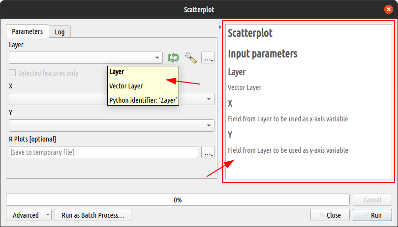
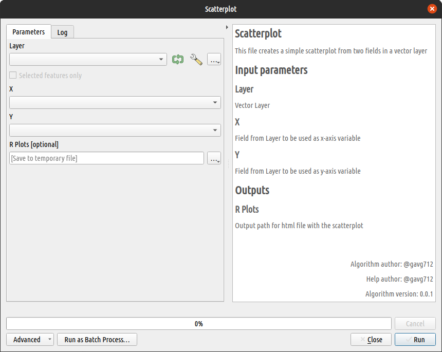
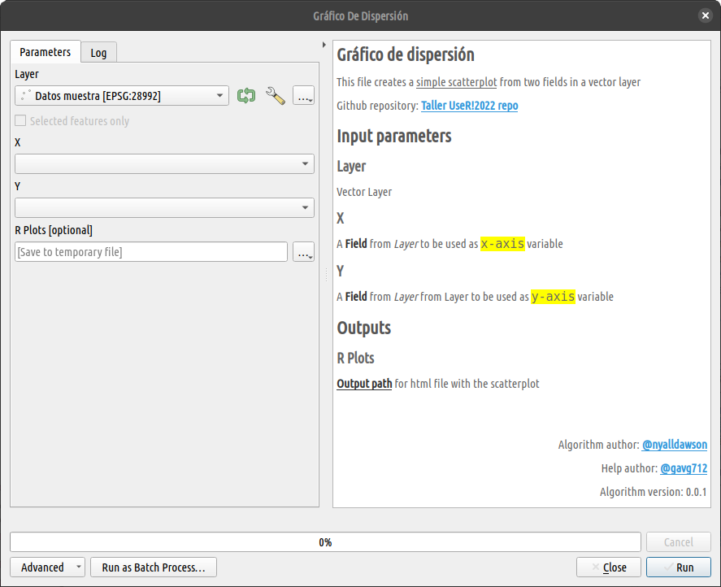

## Introduction

La documentación del software y scripts  es una tarea bastante demandada por los usuarios. Las mejores herramientas de software en cualquier campo tienen particular énfasis en la documentación para el usuario. Así se aseguran que la herramienta se usada por una mayor cantidad de personas.

QGIS y R no son la excepción. Tienen suficiente documentación como sea necesaria para hacerle la vida más fácil a sus usuarios. Incluso a nivel de parámetro, según Nyall Dawson ([Comentario #104:1028490076](https://github.com/north-road/qgis-processing-r/pull/104#issuecomment-1028490076)):

> *...hay un movimiento en proveer una mejor ayuda para usuarios de los algoritmos del núcleo de QGIS, agregando tips a los parámetros individuales de las herramientas, en ese sentido  puedo ver que teniendo este soporte en el proveedor de R es una buena cosa*

Eso es lo que queremos transmitir con este segundo ejercicio. Proveer al usuario de la información suficiente de cómo usar un script de R para *QGIS Processing*

## Escribiendo la ayuda

Sabemos que un script de R para *QGIS Processing* tiene dos partes fundamentales para ejecutar un proceso: El encabezado y el cuerpo. Sin embargo también se puede agregar una tercera sección de información que permite complementar la herramienta. Esta tercera sección habitualmente se escribe en un fichero complementario de extensión `rsx.help`.

### Ficheros `rsx.help`

El archivo de ayuda debe estar ubicado en el mismo directorio y tener el nombre del script, pero con extensión `.rsx.help`. El contenido de este archivo es un objeto JSON con las descripciones de los parámetros. 

Por ejemplo, supongamos que hemos añadido un fichero script llamado `simple_scatterplot.rsx` con el siguiente contenido:

```r
##Example scripts=group
##Scatterplot=name
##output_plots_to_html
##Layer=vector
##X=Field Layer
##Y=Field Layer

# simple scatterplot
plot(Layer[[X]], Layer[[Y]])
```

El fichero de ayuda debería ser llamado `simple_scatterplot.rsx.help` y su contenido mínimo debería ser:

```json
{
"Layer": "Vector Layer",
"X": "Field from Layer to be used as x-axis variable",
"Y": "Field from Layer to be used as y-axis variable"
}
```



Note que la descripción de cada parámetro está compuesta por un par `"clave":"valor"` y está separado de otros parámetros por una coma (,). Este fichero ya se podría usar para la descripción de la herramienta nueva. Pero aún hay más cosas que podemos usar para darle más valor informativo. Hay unos cuantos parámetros especiales que no tienen un nombre definido por el autor del script sino por el el complemento como tal. Estos son:

- `"ALG_DESC"`. Es la descripción general de la herramienta. Esta se mostrará inmediatamente después del título de la sección de ayuda.
- `"ALG_VERSION"`. Sirve para especificar la versión del script, especialmente cuando el autor lleva un control de versiones.
- `"ALG_CREATOR"`. Es para definir el nombre del autor del script.
- `"ALG_HELP_CREATOR"`. Es para definir el nombre de quien escribió la ayuda del script.
- `"RPLOTS"`. Es la descripción para el gráfico de salida en el caso de que el script genere un gráfico.
- `"R_CONSOLE_OUTPUT"`. Es la descripción para el fichero log de la consola en el caso de que el script incluya una salida a consola.

Cualquiera de estos parámetros se pueden agregar al JSON del fichero `rsx.help`, siempre conservando la estructura de `"clave":"valor"`. Si seguimos con nuestro ejemplo anterior podemos agregar varios de estos parámetros a la descripción. Así:

```json
{
"Layer": "Vector Layer",
"X": "Field from Layer to be used as x-axis variable",
"Y": "Field from Layer to be used as y-axis variable",
"RPLOTS": "Output path for html file with the scatterplot",
"ALG_DESC": "This file creates a simple scatterplot from two fields in a vector layer",
"ALG_CREATOR": "Name of algorithm creator",
"ALG_HELP_CREATOR": "Name of help creator",
"ALG_VERSION": "0.0.1"
}
```



### Ayuda como líneas del script

A partir de la versión 3.2.0 del plugin, también es posible introducir la documentación como líneas en el propio script. Esto permite prescindir del archivo `rsx.help`. Para ello, las líneas de documentación deben ser escritas con la estructura `#' Parámetro: Descripción` . Veamos cómo sería usando el ejemplo anterior. 


```json
##Example scripts=group
##Scatterplot=name
##output_plots_to_html
##Layer=vector
##X=Field Layer
##Y=Field Layer

# simple scatterplot
plot(Layer[[X]], Layer[[Y]])

#' Layer: Vector Layer
#' X: Field from Layer to be used as x-axis variable
#' Y: Field from Layer to be used as y-axis variable
#' RPLOTS: Output path for html file with the scatterplot
#' ALG_DESC: This file creates a simple scatterplot from 
#'         : two fields in a vector layer
#' ALG_CREATOR: Name of algorithm creator
#' ALG_HELP_CREATOR: Name of help creator
#' ALG_VERSION: 0.0.1
```

El resultado se mostrará exactamente como cuando se usan los ficheros de ayuda. Además, nótese que de este modo también es posible introducir la descripción de un parámetro en varias líneas. Para ello, es necesario continuar las líneas posteriores sin introducir el nombre del parámetro, así `#' : descripción adicional`.

## Estructura y estilos con HTML.

En las líneas de ayuda también se pueden introducir pequeños elementos de código HTML. Éste será evaluado al momento de ejecutar la herramienta. Desafortunadamente no todas las bodades de html y css pueden ser usadas. Sin embargo algunas cosas funcionarán.

```html
{
"Layer": "Vector Layer",
"X": "A <b>Field</b> from <em>Layer</em> to be used as <code style='background-color: yellow;'>x-axis</code> variable",
"Y": "A <b>Field</b> from <em>Layer</em> from Layer to be used as <code style='background-color: yellow;'>y-axis</code> variable",
"RPLOTS": "<b style='text-decoration: underline;'>Output path</b> for html file with the scatterplot",
"ALG_DESC": "<p>This file creates a <span style='text-decoration: underline;'>simple scatterplot</span> from two fields in a vector layer</p><p>Github repository: <a href='https://github.com/gavg712/taller-r-scripts-for-qgis'>Taller UseR!2022 repo</a>",
"ALG_CREATOR": "<a href='https://github.com/gavg712'>@gavg712</a>",
"ALG_HELP_CREATOR": "@gavg712",
"ALG_VERSION": "0.0.1"
}
```



## Ejercicio

Ahora practicaremos documentando el script del ejercicio anterior. Usted puede elegir el texto descriptivo que mejor le parezca para cada parámetro del script. Puede incluir también uno o varios parámetros especiales, según le convenga. Empecemos!

- Primero en función de qué versión del plugin tiene instalado **_Processing R Provider_**, decida qué tipo de formato va a usar para su script. Recuerde que la versión de líneas de documentación en el script solo está disponible a partir de la versión 3.2.0 del plugin.
- Si va a crear un fichero, abra un fichero de texto nuevo y guárdelo en la carpeta de rscripts del plugin.
- Abra ese fichero en modo de edición con cualquier editor de texto.
- Escriba entre llaves `{...}` la descripción para cada parámetro de la herramienta. No olvide poner entre comillas dobles (`"`) tanto la clave como el valor de cada parámetro, y una coma (`,`) para separa cada parámetro.
- Opcionalmente, agregue una descripción general del algoritmo, el nombre del creador del algoritmo o de la ayuda.
- Guarde los cambios y visualice el resultado abriendo el script desde la caja de herramientas de _Processing_

```{r, echo=FALSE}
blogdown::shortcode("notice", "warning", "Ayuda", 
                    .content = "El contenido a continuación ha sido ocultado intencionalmente. Despliégalo solo si sientes que no puedes realizar el ejercicio por tu cuenta.")
```

<details style="margin-bottom:10px;">
<summary>
Haz clic para mostrar el contenido de ayuda.
</summary>

- Opción 1. Guardar un fichero `rsx.help` en la misma ubicación de los rscripts de processing, con el contenido:

    ```json
    {
    "Capa": "Una capa vectorial que contenga la variable a graficar",
    "Campo": "Un campo de la capa de entrada. Este será la <em>variable</em> a graficar",
    "Transform": "Opcional. Se puede elegir un método de transformación de la variable.",
    "ALG_DESC": "Esta herramienta permite crear un gráfico que combina un violín y un boxplot, usando <code style='color: #dfdfdf;background-color: #2e393d;'>ggplot2</code>",
    "ALG_CREATOR": "<Nombre del creador>",
    "ALG_HELP_CREATOR": "Instructores",
    "ALG_VERSION": "0.0.1"
    }
    ```

- Opción 2. Escribir la documentación en el mismo script (solo a partir de la versión 3.2.0 del plugin).

    ``` html
    #' Capa: Una capa vectorial que contenga la variable a graficar
    #' Campo: Un campo de la capa de entrada. Este será la <em>variable</em> a graficar
    #' Transform: Opcional. Se puede elegir un método de transformación de la variable.
    #' ALG_DESC: Esta herramienta permite crear un gráfico que combina un violín y un boxplot,
    #' :usando <code style="padding:2px;color: #dfdfdf;background-color: #2e393d;">ggplot2</code>
    #' ALG_CREATOR: <Nombre del creador>
    #' ALG_HELP_CREATOR: Instructores
    #' ALG_VERSION: 0.0.1
    
    ##Taller UseR!2022=group
    ##violinandboxplot=name
    ##Gráfico de violin y boxplot=display_name
    ##Capa=vector
    ##Campo=Field Capa
    ##Transform=optional enum boxcox;exp;log;log10;log1p;log2;logit;probability;probit;pseudo_log;reciprocal;reverse;sqrt
    ##output_plots_to_html
    
    library(ggplot2)
    ... < RESTO DEL CUERPO >
    
    ```

</details>

