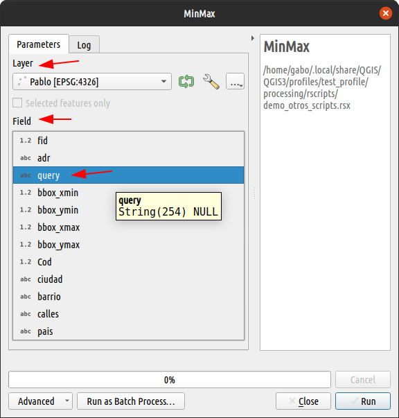

### 2.1 Introduction

Advanced specification is a new feature of the 3.x versions of the plugin. This type of configuration has a different logic than the usual way of specifying parameters, because the structure is different.

In this part of the tutorial we will study the advantages of using the advanced specification in a script.

Let's get started!

### Structure and logic

Just as in the normal specification the parameter lines had a structure, so too the advanced specification has a structure that must be maintained. The structure follows this logic:

```r
##QgsProcessingParameter<Tipo>|Nombre|Descripción|<Otros Argumentos separados pipe>
```

It starts with two hash signs (`##`), followed by the class name of the parameter in the QGIS API (`QgsProcessingParameter*`) and the arguments of the class separated by a vertical bar (`|`). To understand this structure we must know the QGIS API, either the [C version](https://api.qgis.org/api) or the [Python](https://qgis.org/pyqgis/master/). What we have to look for are the details of the `QgsProcessingParameter<type>` classes: Here is a table with the QGIS classes and the corresponding _Processing R_ input parameter.

|Parameter      |Class QGIS API   |
|:--------------|:---------------|
|`vector`       |[QgsProcessingParameterFeatureSource](https://qgis.org/pyqgis/master/core/QgsProcessingParameterFeatureSource.html)|
|`raster`       |[QgsProcessingParameterRasterLayer](https://qgis.org/pyqgis/master/core/QgsProcessingParameterRasterLayer.html)|
|`number`       |[QgsProcessingParameterNumber](https://qgis.org/pyqgis/master/core/QgsProcessingParameterNumber.html)|
|`string`       |[QgsProcessingParameterString](https://qgis.org/pyqgis/master/core/QgsProcessingParameterString.html)|
|`boolean`      |[QgsProcessingParameterBoolean](https://qgis.org/pyqgis/master/core/QgsProcessingParameterBoolean.html)|
|`Field`        |[QgsProcessingParameterField](https://qgis.org/pyqgis/master/core/QgsProcessingParameterField.html)|
|`color`        |[QgsProcessingParameterColor](https://qgis.org/pyqgis/master/core/QgsProcessingParameterColor.html)|
|`range`        |[QgsProcessingParameterRange](https://qgis.org/pyqgis/master/core/QgsProcessingParameterRange.html)|
|`datetime`     |[QgsProcessingParameterDateTime](https://qgis.org/pyqgis/master/core/QgsProcessingParameterDateTime.html)|
|`Band`         |[QgsProcessingParameterBand](https://qgis.org/pyqgis/master/core/QgsProcessingParameterBand.html)|
|`extent`       |[QgsProcessingParameterExtent](https://qgis.org/pyqgis/master/core/QgsProcessingParameterExtent.html)|
|`crs`          |[QgsProcessingParameterCrs](https://qgis.org/pyqgis/master/core/QgsProcessingParameterCrs.html)|
|`enum`         |[QgsProcessingParameterEnum](https://qgis.org/pyqgis/master/core/QgsProcessingParameterEnum.html)|
|`enum literal` |Not available [^1]|
|`file`         |[QgsProcessingParameterFile](https://qgis.org/pyqgis/master/core/QgsProcessingParameterFile.html)|
|`folder`       |[QgsProcessingParameterFile (behavior: 1)](https://qgis.org/pyqgis/master/core/QgsProcessingParameterFile.html)|

[^1]: This parameter is for now a plugin hack to get the texts from an `enum`. Future versions of QGIS will come with a new parameter called `QgsProcessingParameterEnumString`, but it has not been implemented yet in this plugin.

### Advanced specification for outputs

Four types of output parameters are currently supported for advanced specification: 

- [QgsProcessingParameterRasterDestination](https://qgis.org/pyqgis/master/core/QgsProcessingParameterRasterDestination.html)
- [QgsProcessingParameterVectorDestination](https://qgis.org/pyqgis/master/core/QgsProcessingParameterVectorDestination.html)
- [QgsProcessingParameterFileDestination](https://qgis.org/pyqgis/master/core/QgsProcessingParameterFileDestination.html)
- [QgsProcessingParameterFolderDestination](https://qgis.org/pyqgis/master/core/QgsProcessingParameterFolderDestination.html)

### Including in a script

In order to understand how to use the advanced specification we will convert the built-in script _Min_Max_ that comes with the _QGIS Processing R_ plugin into a script with advanced specification.

The lines we are interested in changing are 3 and 4:

```r
##Example scripts=group
##Min_Max=name
##Layer=vector
##Field=Field Layer
##Min=output number
##Max=output number
##Summary=output string

Min <- min(Layer[[Field]])
Max <- max(Layer[[Field]])
Summary <- paste(Min, "to", Max, sep = " ")
```

This is how the tool currently looks like. The arrows indicate the parts where our changes will have an effect.



Let's start changing then the line `##Layer=vector` for another one where the variable is still called "Layer", but the description is a more descriptive text, for example *"Capa de entrada"*. Then we will also change the line `##Field=Field Layer`, where we specify that it is of type *"Number"* to avoid problems with text fields.

```r
##Example scripts=group
##Min_Max=name
##QgsProcessingParameterFeatureSource|Layer|Capa de entrada
##QgsProcessingParameterField|Field|Variable|None|Layer|0|False|False
##Min=output number
##Max=output number
##Summary=output string

Min <- min(Layer[[Field]])
Max <- max(Layer[[Field]])
Summary <- paste(Min, "to", Max, sep = " ")
```

The replacement for line three is `##QgsProcessingParameterFeatureSource|Layer|Capa de entrada` for which only the parameter type, variable name and description have been defined. But if you look at the API, that class has five arguments. What happened to the others?.

```python
QgsProcessingParameterFeatureSource(
    name: str, 
    description: str = ‘’, 
    types: Iterable[int] = [], 
    defaultValue: Any = None, 
    optional: bool = False
    ) 
```

Unspecified parameters have default values that can be dispensed with in the specification. This works because the assignment of the values is positional. In the case of line 4, it happens that the fifth and sixth arguments need to be specified, so you must write all the other values (at least) until you match the correct position for the value you want to change. In this case, the parent layer of the field and the field type.

```python
QgsProcessingParameterField(
    name: str, 
    description: str = ‘’, 
    defaultValue: Any = None, 
    parentLayerParameterName: str = ‘’, 
    type: QgsProcessingParameterField.DataType = QgsProcessingParameterField.Any, 
    allowMultiple: bool = False, 
    optional: bool = False, 
    defaultToAllFields: bool = False
    )
```

The image below shows the effects on the tool. Note that the text descriptions have changed and also the options in the list of possible fields have been reduced.


{}
The body of the script has not changed at all, we still keep the variable names used from the beginning. Therefore this script is still fully functional.
{}

### Practice: Advanced specification

Now it is time to practice. Your task will be to change one or several lines of the script _"Zonal mean from top N"_ available in the workshop scripts. The example data are available thanks to the kind contribution of Castillo, L. (2022)[^2].

[^2]: REFERENCIA: Castillo, Luis. (2022). Altura de los árboles. _Post-procesamiento de datos de la primera cobertura LIDAR (año 2009), Cabeza de Fraile, Valencia. España (1a ed.)_ [Raster]. Centro de Nacional de Información Geográfica de España.

{}
If you have correctly installed the [Qgis Resources Sharing](../../extras) plugin and the workshop repository, you should have the scripts visible in the processing toolbox.
{}

Here are the steps you can follow:

1. Right click on the script "Zonal mean from top N" and click on `Edit script...`.
2. In the window that opens you have the whole script, but we are only interested in lines 4 to 8. You can decide which of them you want to try to change.
3. Depending on the line you have chosen you can go to the QGIS API documentation and look for the corresponding arguments for that parameter. Here you have shortcuts to help you:
    - Line 4: [raster](https://qgis.org/pyqgis/master/core/QgsProcessingParameterRasterLayer.html)
    - Line 5: [vector polygon](https://qgis.org/pyqgis/master/core/QgsProcessingParameterFeatureSource.html)
    - Line 6: [Field Zonas](https://qgis.org/pyqgis/master/core/QgsProcessingParameterField.html)
    - Line 7: [number 100](https://qgis.org/pyqgis/master/core/QgsProcessingParameterNumber.html)
    - Line 8: [output vector](https://qgis.org/pyqgis/master/core/QgsProcessingParameterVectorDestination.html)
4. Add a documentation line with the key `#' ALG_CREATOR:<Your name>`, to know who made the modification.
5. When you have finished editing save your changes and test your tool.

{}
The content below has been intentionally hidden. Unfold it only if you feel you cannot perform the exercise on your own.
{}

<details style="margin-bottom:10px;">
<summary>
Click to display the help content.
</summary>

If you have successfully installed QGIS processing and you have the mentioned script available, you can open the script edition and replace all the content with the following:

```r
##Taller UseR!2022=group
##zonalmeantopn=name
##Zonal mean from top N=display_name
#Raster=raster
##QgsProcessingParameterRasterLayer|Raster|Capa raster
##QgsProcessingParameterFeatureSource|Zonas|Capa vector de zonas|2|None|False
##QgsProcessingParameterField|Zonas_Ids|Campo de identificador único de zonas|None|Zonas|-1
##QgsProcessingParameterNumber|Top_N|Número máximo de valores más altos|0|100|False|1
##QgsProcessingParameterVectorDestination|Zonal|Capa de promedio por zona

Zonas_rst <- raster::rasterize(Zonas, Raster, field = Zonas_Ids)
mean_top_100 <- function(x, top = Top_N, na.rm = TRUE) {
  if(na.rm) x <- na.omit(x)
  if(length(x) < top) {
    top <- length(x)
    message("Zone has less than top n values defined. Calculating with availables")
  }
  mean(x[which(rank(-x) <= top)][seq_len(top)])
}
Stats <- raster::zonal(Raster, Zonas_rst, fun = mean_top_100)
colnames(Stats) <- c(Zonas_Ids, paste0("mean_", Top_N))
Zonal <- merge(Zonas, Stats, by = Zonas_Ids)

#'Raster: Capa raster
#'Zonas: Capa vector de polígonos que representan las zonas
#'Zonas_Ids: Campo de la capa de <em>Zonas</em>
#'Top_N: Valor numérico entero que define los n de valores más altos. 
#'Zonal: Salida vectorial con el promedio de las <em>n</em> valores más altos
#'ALG_CREATOR: @gavg712
```
</details>
