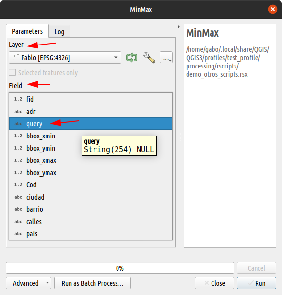
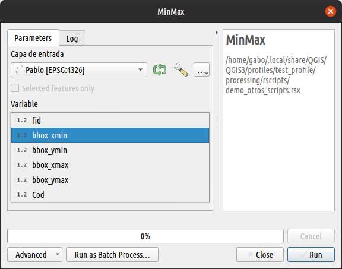

### Introduction

La configuración avanzada es un nueva característica de las versiones 3.x del plugin.
Este tipo de configuración tiene una lógica diferente a la forma habitual de especificar los parámetros, porque la estructura es distinta.

En esta parte del tutorial nos dedicaremos a estudiar las ventajas de usar la especificación avanzada en un script

Comencemos!

### Estructura y lógica

Así como en la especificación normal las líneas de parámetros tenían una estructura, también la especificación avanzada tiene una estructura que debe mantenerse. La lógica es la siguiente:

```r
##QgsProcessingParameter<Tipo>|Nombre|Descripción|<Otros Argumentos separados pipe>
```

Para entender esta estructura debemos conocer la API de QGIS, ya sea la [versión de C](https://api.qgis.org/api) o la de [Python](https://qgis.org/pyqgis/master/). Lo que debemos buscar son los detalles de las clases `QgsProcessingParameter<tipo>`: A continuación una tabla con las clases QGIS y el correspondiente parámetro de entrada de _Processing R_

|Parámetro      |Tipo QGIS API   |
|:--------------|:---------------|
|`vector`       |[QgsProcessingParameterFeatureSource](https://qgis.org/pyqgis/master/core/QgsProcessingParameterFeatureSource.html)|
|`raster`       |[QgsProcessingParameterRasterLayer](https://qgis.org/pyqgis/master/core/QgsProcessingParameterRasterLayer.html)|
|`number`       |[QgsProcessingParameterNumber](https://qgis.org/pyqgis/master/core/QgsProcessingParameterNumber.html)|
|`string`       |[QgsProcessingParameterString](https://qgis.org/pyqgis/master/core/QgsProcessingParameterString.html)|
|`boolean`      |[QgsProcessingParameterBoolean](https://qgis.org/pyqgis/master/core/QgsProcessingParameterBoolean.html)|
|`Field`        |[QgsProcessingParameterField](https://qgis.org/pyqgis/master/core/QgsProcessingParameterField.html)|
|`color`        |[QgsProcessingParameterColor](https://qgis.org/pyqgis/master/core/QgsProcessingParameterColor.html)|
|`range`        |[QgsProcessingParameterRange](https://qgis.org/pyqgis/master/core/QgsProcessingParameterRange.html)|
|`datetime`     |[QgsProcessingParameterDateTime](https://qgis.org/pyqgis/master/core/QgsProcessingParameterDateTime.html)|
|`Band`         |[QgsProcessingParameterBand](https://qgis.org/pyqgis/master/core/QgsProcessingParameterBand.html)|
|`extent`       |[QgsProcessingParameterExtent](https://qgis.org/pyqgis/master/core/QgsProcessingParameterExtent.html)|
|`crs`          |[QgsProcessingParameterCrs](https://qgis.org/pyqgis/master/core/QgsProcessingParameterCrs.html)|
|`enum`         |[QgsProcessingParameterEnum](https://qgis.org/pyqgis/master/core/QgsProcessingParameterEnum.html)|
|`enum literal` |No disponible [^1]|
|`file`         |[QgsProcessingParameterFile](https://qgis.org/pyqgis/master/core/QgsProcessingParameterFile.html)|
|`folder`       |[QgsProcessingParameterFile (behavior: 1)](https://qgis.org/pyqgis/master/core/QgsProcessingParameterFile.html)|

[^1]: Este parámetro es por ahora un truco del plugin para obtener los textos a partir de un `enum`. Futuras versiones de QGIS vendrán un nuevo parámetro denominado `QgsProcessingParameterEnumString`, pero no ha sido implementado todavía en este plugin.

### Especificación avanzada para salidas

Al momento se soportan cuatro tipos de parámetros de salida para especificación avanzada: 

- [QgsProcessingParameterRasterDestination](https://qgis.org/pyqgis/master/core/QgsProcessingParameterRasterDestination.html)
- [QgsProcessingParameterVectorDestination](https://qgis.org/pyqgis/master/core/QgsProcessingParameterVectorDestination.html)
- [QgsProcessingParameterFileDestination](https://qgis.org/pyqgis/master/core/QgsProcessingParameterFileDestination.html)
- [QgsProcessingParameterFolderDestination](https://qgis.org/pyqgis/master/core/QgsProcessingParameterFolderDestination.html)

### Incluyendo en un script

A fin de entender como usar la especificación avanzada convertiremos el Script de ejemplo _Min_Max_ que viene con el plugin _QGIS Processing R_ en un script con especificación avanzada. 

Las líneas que nos interesan cambiar son de la 3 y 4:

```r
##Example scripts=group
##Min_Max=name
##Layer=vector
##Field=Field Layer
##Min=output number
##Max=output number
##Summary=output string

Min <- min(Layer[[Field]])
Max <- max(Layer[[Field]])
Summary <- paste(Min, "to", Max, sep = " ")
```

Así es como se ve la herramienta actualmente. Las flechas indican las partes donde tendrán efecto nuestros cambios



Empecemos cambiando entonces la línea `##Layer=vector` por otra donde la variable se siga llamando "Layer", pero la descripción sea un texto más descriptivo, por ejemplo *"Capa de entrada"*. Luego cambiaremos también la línea `##Field=Field Layer`, donde especifiquemos que sea de tipo *"Number"* para no tener problemas con los campos de texto.

```r
##Example scripts=group
##Min_Max=name
##QgsProcessingParameterFeatureSource|Layer|Capa de entrada
##QgsProcessingParameterField|Field|Variable|None|Layer|0|False|False
##Min=output number
##Max=output number
##Summary=output string

Min <- min(Layer[[Field]])
Max <- max(Layer[[Field]])
Summary <- paste(Min, "to", Max, sep = " ")
```

El reemplazo de la línea tres es `##QgsProcessingParameterFeatureSource|Layer|Capa de entrada` para la cual solo se ha definido el tipo de parámetro, el nombre de la variable y la descripción. Pero si te fijas en la API, esa clase tiene cinco argumentos ¿Qué pasó con los demás?.

```python
QgsProcessingParameterFeatureSource(
    name: str, 
    description: str = ‘’, 
    types: Iterable[int] = [], 
    defaultValue: Any = None, 
    optional: bool = False
    ) 
```

Los parámetros no especificados tienen valores por defecto que se pueden prescindir en la especificación. Esto funciona porque la asignación de los valores es posicional. En el caso de la línea 4, sucede que el quinto y sexto argumento necesitan ser especificados, por lo tanto se debe escribir todos los demás valores (por lo menos) hasta que corresponda con la posición correcta para el valor que queremos cambiar. En este caso, la capa padre del campo y el tipo de campo.

```python
QgsProcessingParameterField(
    name: str, 
    description: str = ‘’, 
    defaultValue: Any = None, 
    parentLayerParameterName: str = ‘’, 
    type: QgsProcessingParameterField.DataType = QgsProcessingParameterField.Any, 
    allowMultiple: bool = False, 
    optional: bool = False, 
    defaultToAllFields: bool = False
    )
```

En la imagen a continuación se muestran los efectos en la herramienta. Nótese que las descripciones de los textos han cambiado y también se han reducido las opciones en la lista de campos posibles.



{}
El cuerpo del script no ha cambiado en nada, seguimos manteniendo los nombres de las variables usadas desde el principio. Por lo tanto este script sigue funcional.
{}

### Ejercicio

Ahora es tiempo de practicar. Tu tarea será cambiar una o varias líneas del script _"Zonal mean from top N"_ disponible en los scripts del taller. Los datos del ejemplo están disponibles gracias a la amable contribución de Castillo, L. (2022)[^2].

[^2]: REFERENCIA: Castillo, Luis. (2022). Altura de los árboles. _Post-procesamiento de datos de la primera cobertura LIDAR (año 2009), Cabeza de Fraile, Valencia. España (1a ed.)_ [Raster]. Centro de Nacional de Información Geográfica de España.

{}
Si has instalado correctamente el plugin [Qgis Resources Sharing](../../extras) y el repositorio del taller, deberías tener los scripts visibles en la caja de herramientas de processing. 
{}

Puedes seguir los siguientes pasos:

1. Clic derecho sobre el script "Zonal mean from top N" y clic en `Edit script...`
2. En la ventana que se abre tienes todo el script, pero solo nos interesan las lineas de la 4 a la 8. Puedes decidir cual de ellas quieres intentar cambiar.
3. Dependiendo la línea que hayas elegido puedes ir a la documentación de la API de QGIS y buscar los argumentos que correspondan para ese parámetro. Aquí tienes accesos directos como ayuda:
    - Línea 4: [raster](https://qgis.org/pyqgis/master/core/QgsProcessingParameterRasterLayer.html)
    - Línea 5: [vector polygon](https://qgis.org/pyqgis/master/core/QgsProcessingParameterFeatureSource.html)
    - Línea 6: [Field Zonas](https://qgis.org/pyqgis/master/core/QgsProcessingParameterField.html)
    - Línea 7: [number 100](https://qgis.org/pyqgis/master/core/QgsProcessingParameterNumber.html)
    - Línea 8: [output vector](https://qgis.org/pyqgis/master/core/QgsProcessingParameterVectorDestination.html)
4. Agrega una línea de documentación con la clave `#' ALG_CREATOR:<Tu nombre>`, para saber quien hizo la modificación
5. Cuando hayas terminado de editar guarda los cambios y prueba tu herramienta.

{}
El contenido a continuación ha sido ocultado intencionalmente. Despliégalo solo si sientes que no puedes realizar el ejercicio por tu cuenta.
{}

<details style="margin-bottom:10px;">
<summary>
Haz clic para mostrar el contenido de ayuda.
</summary>

Si has instalado correctamente QGIS processing y tienes disponible el script mencionado, puedes abrir la edición del script y reemplazar todo el contenido con el siguiente:

```r
##Taller UseR!2022=group
##zonalmeantopn=name
##Zonal mean from top N=display_name
#Raster=raster
##QgsProcessingParameterRasterLayer|Raster|Capa raster
##QgsProcessingParameterFeatureSource|Zonas|Capa vector de zonas|2|None|False
##QgsProcessingParameterField|Zonas_Ids|Campo de identificador único de zonas|None|Zonas|-1
##QgsProcessingParameterNumber|Top_N|Número máximo de valores más altos|0|100|False|1
##QgsProcessingParameterVectorDestination|Zonal|Capa de promedio por zona

Zonas_rst <- raster::rasterize(Zonas, Raster, field = Zonas_Ids)
mean_top_100 <- function(x, top = Top_N, na.rm = TRUE) {
  if(na.rm) x <- na.omit(x)
  if(length(x) < top) {
    top <- length(x)
    message("Zone has less than top n values defined. Calculating with availables")
  }
  mean(x[which(rank(-x) <= top)][seq_len(top)])
}
Stats <- raster::zonal(Raster, Zonas_rst, fun = mean_top_100)
colnames(Stats) <- c(Zonas_Ids, paste0("mean_", Top_N))
Zonal <- merge(Zonas, Stats, by = Zonas_Ids)

#'Raster: Capa raster
#'Zonas: Capa vector de polígonos que representan las zonas
#'Zonas_Ids: Campo de la capa de <em>Zonas</em>
#'Top_N: Valor numérico entero que define los n de valores más altos. 
#'Zonal: Salida vectorial con el promedio de las <em>n</em> valores más altos
#'ALG_CREATOR: @gavg712
```
</details>
