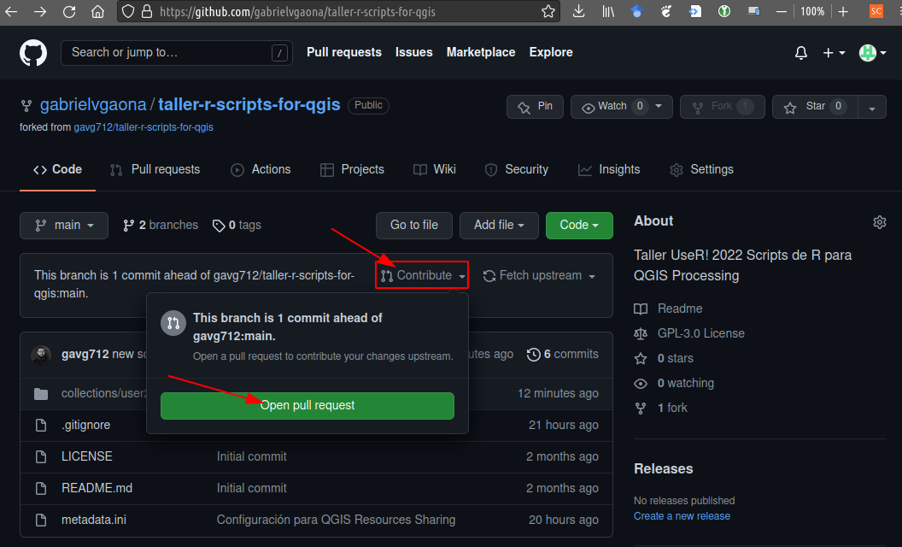

The workshop repository is configured to be used together with [QGIS Resource Sharing](https://qgis-contribution.github.io/QGIS-ResourceSharing/) to install R Scripts for QGIS. This will be used as a repository to share the tools developed by the other participants. The configuration of this repository is explained in the entry on [QGIS Resource Sharing](../extras).

We invite you to share your tools through a PR to the main branch of the repository on GitHub. Please take into consideration the following instructions:

1. Create a repository fork [gavg712/taller-r-scripts-for-qgis](https://github.com/gavg712/taller-r-scripts-for-qgis) from your GitHub account: 

    

2. From the console or from Rstudio, clone the repository from your GitHub account, to have a local version on your computer.

    ```bash
    cd <working directory>
    git clone https://github.com/<user>/taller-r-scripts-for-qgis.git
    # Change <user> with your GitHub account
    ```
3. Add/Copy the files you want to share (`*.rsx`, `*rsx.help`) to the `collections/user2022-rscripts/rscripts` directory and commit git index.

    ```bash
    cd taller-r-scripts-for-qgis
    git add --all
    git commit -m "<script name>"
    git push
    ```

4. Create a _Pull Request_ from your fork to the repository of the workshop.

    

{}
The PRs we receive will be accepted during the tutorial so that they can be available for the final part of the tutorial.
{}
