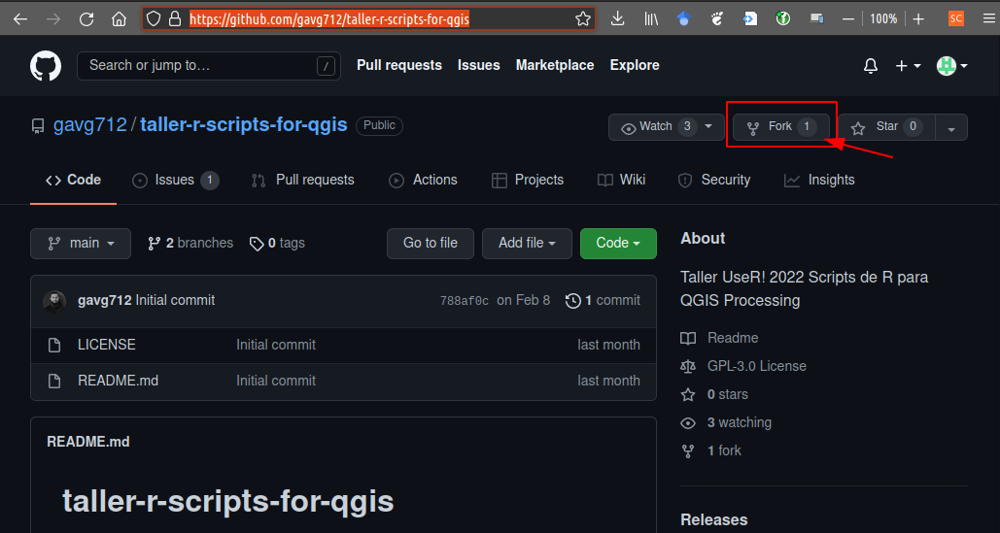
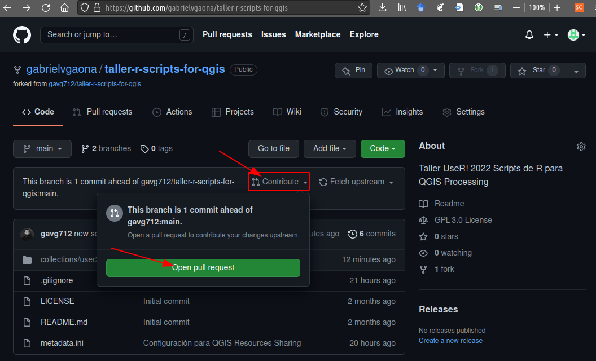

El repositorio del taller está configurado para ser usado junto a [QGIS Resource Sharing](https://qgis-contribution.github.io/QGIS-ResourceSharing/) para instalar los Scripts R para QGIS. Este usaremos como repositorio para compartir las herramientas desarrolladas por los demás participantes. La configuración de este repositorio se explica en la entrada sobre [QGIS Resource Sharing](../extras).

Les invitamos a compartir sus herramientas mediante una PR a la rama principal del repositorio en GitHub. Para lo cual por favor tomar en consideración las siguientes instrucciones:

1. Haz un Fork del repositorio [gavg712/taller-r-scripts-for-qgis](https://github.com/gavg712/taller-r-scripts-for-qgis) usando tu cuenta de GitHub: 

    

2. Desde la consola o desde Rstudio, clona el repositorio desde tu cuenta de GitHub, para tener una versión local íntegra en tu computador.

    ```bash
    cd <directorio de trabajo>
    git clone https://github.com/<usuario>/taller-r-scripts-for-qgis.git
    # Cambia <usuario> por tu usuario de github
    ```
3. Agrega/Copia los ficheros que quieras compartir (`*.rsx`, `*rsx.help`) al directorio `collections/user2022-rscripts/rscripts` y registra el cambio en el índice de git.

    ```bash
    cd taller-r-scripts-for-qgis
    git add --all
    git commit -m "<nombre del script>"
    git push
    ```

4. Haz un _Pull Request_ desde tu fork al repositorio del taller

    

{}
Los PR que recibamos serán aceptados durante el tutorial de manera que puedan estar disponibles para el tramo final del tutorial.
{}

